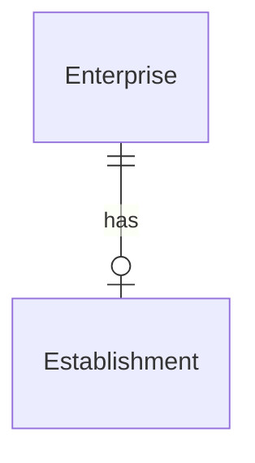

# Belgian KBO data model

This repository contains the data model for the Belgian KBO 
(Kruispuntbank van Ondernemingen) as a set of CSV files. 
The data model is based on the 
[official documentation](https://economie.fgov.be/sites/default/files/Files/Entreprises/KBO/Cookbook-KBO-Open-Data.pdf) 
of the KBO.

The data itself can be downloaded after creating an account on 
[their website](https://kbopub.economie.fgov.be/kbo-open-data/login)

# Usage

* download & unzip the data from KBO
* set the path to the folder and the sqlite db in appsettings.json
* run the CLI 

# Data model (ERD)

```
using Microsoft.EntityFrameworkCore;
using Microsoft.EntityFrameworkCore.Design;

using Net.Code.Csv;

using System.ComponentModel.DataAnnotations.Schema;

namespace Net.Code.Kbo.Data;

public class DesignTimeContextFactory : IDesignTimeDbContextFactory<KboDataContext>
{
    public KboDataContext CreateDbContext(string[] args)
    {
        var optionsBuilder = new DbContextOptionsBuilder<KboDataContext>();
        optionsBuilder.UseSqlite("Data Source=..\\test\\data\\data.db");

        return new KboDataContext(optionsBuilder.Options);
    }
}
public class KboDataContext(DbContextOptions<KboDataContext> options) : DbContext(options)
{
    protected override void OnModelCreating(ModelBuilder modelBuilder)
    {
        base.OnModelCreating(modelBuilder);

        modelBuilder.Entity<Activity>()
            .HasKey(a => new { a.EnterpriseNumber, a.NaceCode, a.NaceVersion, a.Classification, a.ActivityGroup });

        modelBuilder.Entity<Address>()
            .HasKey(a => new { a.EntityNumber, a.TypeOfAddress });

        modelBuilder.Entity<Code>()
            .HasKey(c => new { c.CodeValue, c.Language, c.Category });

        modelBuilder.Entity<Contact>()
            .HasKey(c => new { c.EntityNumber, c.Value, c.EntityContact, c.ContactType });

        modelBuilder.Entity<Denomination>()
            .HasKey(d => new { d.EntityNumber, d.TypeOfDenomination, d.Language });

        modelBuilder.Entity<Enterprise>()
            .HasKey(e => e.EnterpriseNumber);

        modelBuilder.Entity<Establishment>()
            .HasKey(e => e.EstablishmentNumber);

        modelBuilder.Entity<Meta>()
            .HasKey(m => m.Variable);
        // Indexes
        modelBuilder.Entity<Activity>()
            .HasIndex(a => a.NaceCode)
            .HasDatabaseName("Activity_NaceCode_idx");

        modelBuilder.Entity<Code>()
            .HasIndex(c => c.CodeValue)
            .HasDatabaseName("Code_Code_idx");

        modelBuilder.Entity<Enterprise>()
            .HasIndex(e => e.JuridicalForm)
            .HasDatabaseName("Enterprise_JuridicalForm_idx");

        modelBuilder.Entity<Enterprise>()
            .HasIndex(e => e.StartDate)
            .HasDatabaseName("Enterprise_StartDate_idx");

        modelBuilder.Entity<Establishment>()
            .HasIndex(e => e.StartDate)
            .HasDatabaseName("Establishment_StartDate_idx");

    }

    public DbSet<Enterprise> Enterprises { get; set; }
}

public class Enterprise
{
    public required string EnterpriseNumber { get; set; } = string.Empty;
    public required string Status { get; set; } = string.Empty;
    public required string JuridicalSituation { get; set; } = string.Empty;
    public required string TypeOfEnterprise { get; set; } = string.Empty;
    public required string JuridicalForm { get; set; } = string.Empty;
    public required string JuridicalFormCAC { get; set; } = string.Empty;
    [CsvFormat("dd-MM-yyyy")]
    public DateTime StartDate { get; set; }
}

public class Establishment
{
    public required string EstablishmentNumber { get; set; } = string.Empty;
    [CsvFormat("dd-MM-yyyy")]
    public DateTime StartDate { get; set; }
    public required string EnterpriseNumber { get; set; } = string.Empty;
}

public class Activity
{
    public required string EnterpriseNumber { get; set; } = string.Empty;
    public string ActivityGroup { get; set; } = string.Empty;
    public string NaceVersion { get; set; } = string.Empty;
    public string NaceCode { get; set; } = string.Empty;
    public string Classification { get; set; } = string.Empty;
}

public class Branch
{
    public required string Id { get; set; } = string.Empty;
    [CsvFormat("dd-MM-yyyy")]
    public DateTime StartDate { get; set; }
    public required string EnterpriseNumber { get; set; } = string.Empty;
}

public class Address
{
    public required string EntityNumber { get; set; } = string.Empty;
    public string TypeOfAddress { get; set; } = string.Empty;
    public string CountryNL { get; set; } = string.Empty;
    public string CountryFR { get; set; } = string.Empty;
    public string Zipcode { get; set; } = string.Empty;
    public string MunicipalityNL { get; set; } = string.Empty;
    public string MunicipalityFR { get; set; } = string.Empty;
    public string StreetNL { get; set; } = string.Empty;
    public string StreetFR { get; set; } = string.Empty;
    public string HouseNumber { get; set; } = string.Empty;
    public string Box { get; set; } = string.Empty;
    public string ExtraAddressInfo { get; set; } = string.Empty;
    [CsvFormat("dd-MM-yyyy")]
    public DateTime DateStrikingOff { get; set; }
}

public class Contact
{
    public required string EntityNumber { get; set; } = string.Empty;
    public string EntityContact { get; set; } = string.Empty;
    public string ContactType { get; set; } = string.Empty;
    public string Value { get; set; } = string.Empty;
}

public class Denomination
{
    public required string EntityNumber { get; set; } = string.Empty;
    public string Language { get; set; } = string.Empty;
    public string TypeOfDenomination { get; set; } = string.Empty;
    [Column("Denomination")]
    public string DenominationValue { get; set; } = string.Empty;
}

public class Meta
{
    public required string Variable { get; set; } = string.Empty;
    public string Value { get; set; } = string.Empty;
}

public class Code
{
    public required string Category { get; set; } = string.Empty;
    [Column("Code")]
    public required string CodeValue { get; set; } = string.Empty;
    public string Language { get; set; } = string.Empty;
    public string Description { get; set; } = string.Empty;
}
```




